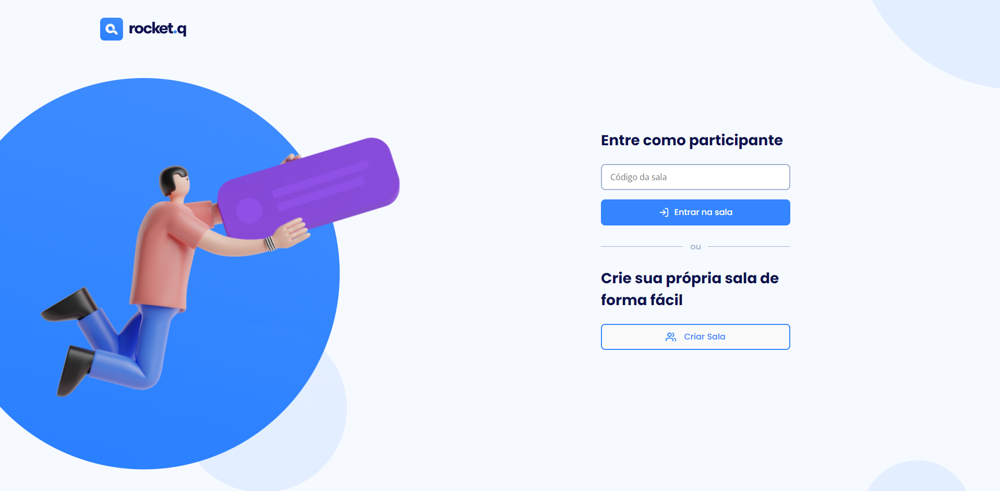
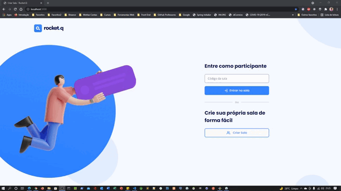
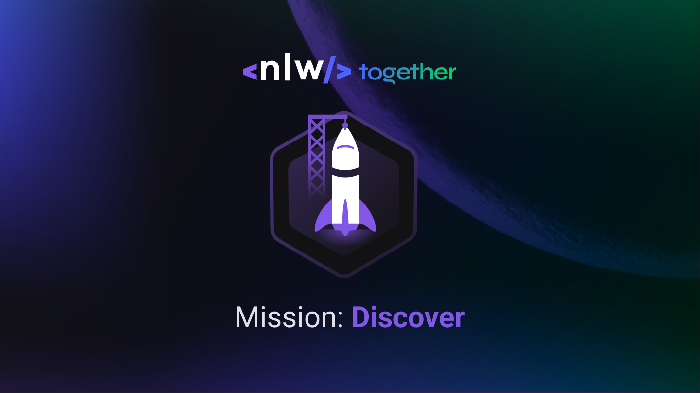

<h1 align="center">
  
</h1>

<p align="center">
  <a href="#-tecnologias">Tecnologias</a>&nbsp;&nbsp;&nbsp;|&nbsp;&nbsp;&nbsp;
  <a href="#-projeto">Projeto</a>&nbsp;&nbsp;&nbsp;|&nbsp;&nbsp;&nbsp;
  <a href="#-layout">Layout</a>&nbsp;&nbsp;&nbsp;|&nbsp;&nbsp;&nbsp;
  <a href="#memo-licença">Licença</a>
</p>

<p align="center">
 

  
</p>

<br>

## Prévia vizualização do Front-end

- Capa
<p align="center">
  
</p>

<br>

Tela inicial do sistema.

<p align="center">
    
</p>
<br>

Funções do sistema em Gift

- [Assistir no YouTube](https://www.youtube.com/watch?v=sDwDWC32cOc)

<p align="center">
    
</p>
<br>

## 🚀 Tecnologias

Esse projeto foi desenvolvido com as seguintes tecnologias:

- [HTML5](https://www.w3schools.com/html/default.asp)
- [CSS](https://developer.mozilla.org/pt-BR/docs/Web/CSS)
- [JavaScript](https://www.javascript.com/)
- [Node.js](https://nodejs.org/en/)
- [EJS como Template Engine em Node.js](https://www.npmjs.com/package/ejs)
- [Express](http://expressjs.com/pt-br/)
- [SQLite](https://sqlite.org/index.html)

## 💻 Projeto

O Rocket.Q é uma aplicação de interação através de perguntas, sendo possível criar uma sala para internautas anônimos fazerem perguntas e o criador da sala em posse de uma senha gerenciar essas perguntas e marcar como lidas e ou excluir.

## 🔖 Layout

Você pode visualizar o layout do projeto através [desse link](https://www.figma.com/community/file/1009821158959690135/Roquet.q). É necessário ter conta no [Figma](https://figma.com) para acessá-lo.

<br>

## Executar Aplicação

## 🔥 Executando Localmente a Aplicação

Caso você deseja executar o projeto na sua máquina local, você terá que instalar o Node.js.<br>
Após instalar, basta seguir os passos abaixo:

### 🌀 Começando...

Para começar, você deve simplesmente clonar o repositório do projeto na sua máquina e instalar as dependências.

#### ❗️ Instalando as Dependências (via Windows):

Abre o cmd (caso esteja utilizando o Windows) navegue até o local onde você clonou o projeto

```
cd "C:\Users\NomeDoComputador\Documents\clonedoprojeto"
```

Depois, acessar a pasta do projeto.
Dentro do projeto `Rocket.Q` digitar no cmd a seguinte instrução: **(dentro da pasta `Rocket.Q` do projeto clonado)**

```
npm install
```

Ao digitar a instrução acima, automaticamente ele irá baixar todas as dependências listadas e definidas no arquivo package.json:

- `node_modules` - que contêm os packages do npm que precisará para o projeto.

Após executar o comando acima e instalar as dependências do projeto, executar o comando:

```
npm run init-db
```

Ao executar o comando acima será criado o Banco de Dados SQLite dentro de src/db com o nome rocketq.sqlite

<br>

Agora é só executar o comando para iniciar o servidor Node.js

```
npm start
```

Pronto! dessa forma o projeto Rocket.Q estará rodando localmente em sua maquina, acesse:

```
http://localhost:3000
```

<br>

## 🚩 Tenho Dúvidas... O que fazer?

Caso tenham dúvidas sobre o código do projeto, sintam-se a vontade em abrir uma **[ISSUE AQUI](https://github.com/Wanderson-A-Timoteo/Rocket.q/issues)**. Assim que possível, estarei respondendo a todas as dúvidas que tiverem!

<br>

## :memo: Licença

Esse projeto está sob a licença MIT. Veja o arquivo [LICENSE](.github/LICENSE.md) para mais detalhes.

## Autor:

Feito com ♥ by

- [**Wanderson A. Timóteo**](https://wanderson.tk)

<br>

## Agradecimentos:

<h2 align="center">
    Rocketseat
</h2>

<h1 align="center">
    
</h1>

<br>

Projeto desenvolvido durante a [NLW Together Mission Discover](https://app.rocketseat.com.br)

Agradecimento a [Jake Gracielly](https://github.com/jakeliny) por compartilhar conteúdo relevante e com qualidade de ensino.

Feito com ♥ by Rocketseat :wave: [Participe da nossa comunidade!](https://discordapp.com/invite/gCRAFhc)
